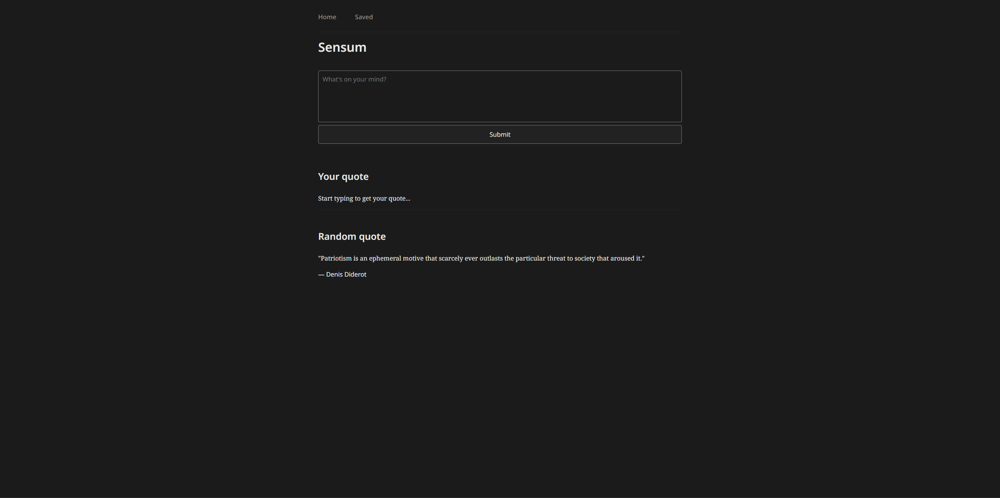

# 🌿 Sensum

**Sensum** is a minimalist web app that helps you reflect on your thoughts. It uses natural language processing (NLP) to analyze what you write, detect the most relevant emotional and thematic categories, and suggest a matching quote from a dataset of over 500,000 quotes.

## ✨ Features

- 🧠 **Text analysis** using zero-shot classification
- 🏷️ Detects up to 5 best-matching categories from user input
- 💬 Suggests a quote aligned with your emotional context
- 🔍 Quote database of 500K+ entries with authors and tags
- ⚡ Clean, responsive UI built with HTML, CSS, and JS
- 🧩 Modular Flask backend with REST API routes

## 📸 Preview



## 🚀 Getting Started

### 1. Clone the repo

```bash
git clone https://github.com/Hadevsh/Sensum.git
cd Sensum
```

### 2. Create and activate a virtual environment

```bash
python -m venv .venv
source .venv/bin/activate        # Mac/Linux
.venv\Scripts\activate           # Windows
```

### 3. Install dependencies

```bash
pip install -r requirements.txt
```

### 4. Add the CSV file with quotes
Make sure you have your CSV file in:
```
data/quotes.csv
```
It should include the columns: `quote`, `author`, `category`

## 🧠 Usage
### Run the app

```bash
python app.py
```
Then visit [http://localhost:5000](http://localhost:5000)

## 📁 Project Structure

```
Sensum/
├── app.py
├── requirements.txt
├── templates/
│   └── index.html
├── static/
|   ├── csv/
|   |   └── quotes.csv
│   ├── css/
│   │   └── index.css
│   ├── js/
│   │   └── index.js
│   ├── assets/
│   |   └── icon.ico
├── utils/
│   └── model.py
└── README.md
```

## 🛠 Tech Stack
- Python 3.10+
- Flask
- Hugging Face Transformers (`facebook/bart-large-mnli`)
- HTML5 / CSS3 / JS (Vanilla)
- Pandas, Torch

## 🧘 Made with purpose — *for reflection, not distraction.*
